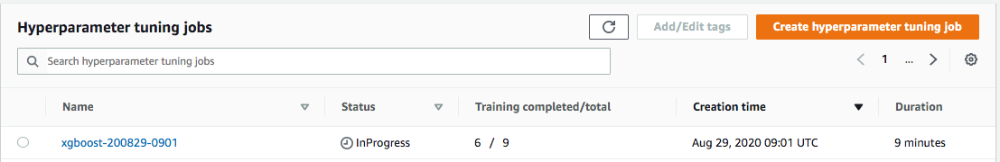

# Hyper Parameters Optimization (HPO)

This notebook shows how to perform Hyper Parameters Optimization.

## Step 1

- Perform hyper parameters optimization using SageMaker

## Step 2

- Analyze HPO results using the tuning job in step 1.
- You can find the tuning job name on the console after step 1 has completed.

