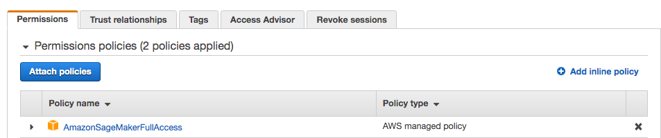

# sagemaker-workshop

## Create Notebook

- Key in the name and instance type, leave other settings as default

- Create a new SageMaker role. Select any S3 bucket for this demo purpose

- Launch Jupyter Lab once notebook is ready

## Additional IAM Roles

You may need additional IAM roles depending on AWS Services that you are accessing. You can go to IAM service, select Role on the left menu and add the necessary permission to the newly created sagemaker

