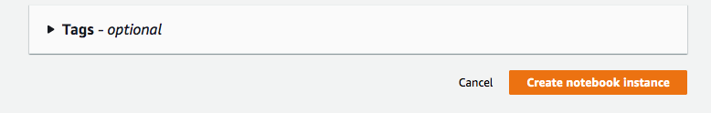

# sagemaker-workshop

The objective of the workshop is to demonstrate SageMaker capability for machine learning developer to build, train and deploy model at scale.

Before you begin, please follow the steps below to launch jupyterlab.

## Region

- Make sure your region is set to Singapore (ap-southeast-1) on the console

## Create Notebook

- Step 1: Key in the name and instance type, leave other settings as default

- Step 2a: Select "Create a new role".

- Step 2b: Select "Any S3 Bucket" for this demo purpose.

- Step 3: Fill in Git Repository.

- Setp 4: Click “Create notebook instance” to create the notebook

## Launch Jupyter Lab

You can launch the notebook by clicking "Open JupyterLab" once the status is in service

